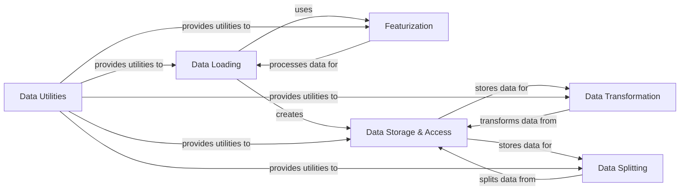

## Component Details

The Data Pipeline subsystem in DeepChem is responsible for managing the entire data lifecycle, from initial loading and conversion of raw data into numerical features (featurization) to applying various transformations and splitting datasets for machine learning model training and evaluation. It ensures data readiness by handling diverse data formats and providing structured access to processed data.

### Data Loading

Handles the loading of raw data from various sources and orchestrates the initial processing, often involving featurization, to prepare data for further steps in the pipeline. It acts as an entry point for raw data into the DeepChem ecosystem.

**Related Classes/Methods**:

- <a href="https://github.com/deepchem/deepchem/blob/master/deepchem/data/data_loader.py#L72-L278" target="_blank" rel="noopener noreferrer">`deepchem.data.data_loader.DataLoader` (72:278)</a>

### Featurization

Transforms raw chemical, biological, or other domain-specific data into numerical feature vectors. This component includes a base class for all featurizers and numerous specialized implementations tailored for different data types, enabling the conversion of diverse inputs into a machine-readable format.

**Related Classes/Methods**:

- `deepchem.feat.base_classes` (full file reference)

- `deepchem.feat.deepvariant_featurizer` (full file reference)

- `deepchem.feat.graph_data` (full file reference)

- `deepchem.feat.reaction_featurizer` (full file reference)

- `deepchem.feat.molecule_featurizers` (full file reference)

### Data Storage & Access

Manages the storage, organization, and retrieval of featurized datasets. It provides an abstract interface for datasets and concrete implementations for handling data in memory or on disk, facilitating efficient access and iteration over data samples and batches.

**Related Classes/Methods**:

- <a href="https://github.com/deepchem/deepchem/blob/master/deepchem/data/datasets.py#L221-L743" target="_blank" rel="noopener noreferrer">`deepchem.data.datasets.Dataset` (221:743)</a>

- <a href="https://github.com/deepchem/deepchem/blob/master/deepchem/data/datasets.py#L1110-L2720" target="_blank" rel="noopener noreferrer">`deepchem.data.datasets.DiskDataset` (1110:2720)</a>

- `deepchem.data.pytorch_datasets` (full file reference)

### Data Transformation

Applies various preprocessing steps and transformations to the featurized data, such as normalization, scaling, or other data manipulation techniques. This component ensures data is in an optimal format for model training and can handle complex transformations.

**Related Classes/Methods**:

- <a href="https://github.com/deepchem/deepchem/blob/master/deepchem/trans/transformers.py#L56-L238" target="_blank" rel="noopener noreferrer">`deepchem.trans.transformers.Transformer` (56:238)</a>

- `deepchem.trans.duplicate` (full file reference)

### Data Splitting

Handles the partitioning of datasets into subsets (e.g., training, validation, test sets) for model development and evaluation. It provides various splitting strategies to ensure proper data distribution and prevent data leakage, crucial for robust model assessment.

**Related Classes/Methods**:

- <a href="https://github.com/deepchem/deepchem/blob/master/deepchem/splits/splitters.py#L31-L325" target="_blank" rel="noopener noreferrer">`deepchem.splits.splitters.Splitter` (31:325)</a>

- `deepchem.splits.task_splitter` (full file reference)

- `deepchem.contrib.atomicconv.splits` (full file reference)

### Data Utilities

Provides a collection of helper functions and utilities that support various data-related operations across the data pipeline. This includes general data manipulation, caching mechanisms, and other foundational tools that enhance the efficiency and flexibility of data handling.

**Related Classes/Methods**:

- `deepchem.utils.data_utils` (full file reference)

- `deepchem.utils.cache_utils` (full file reference)

- `deepchem.data.supports` (full file reference)

### [FAQ](https://github.com/CodeBoarding/GeneratedOnBoardings/tree/main?tab=readme-ov-file#faq)