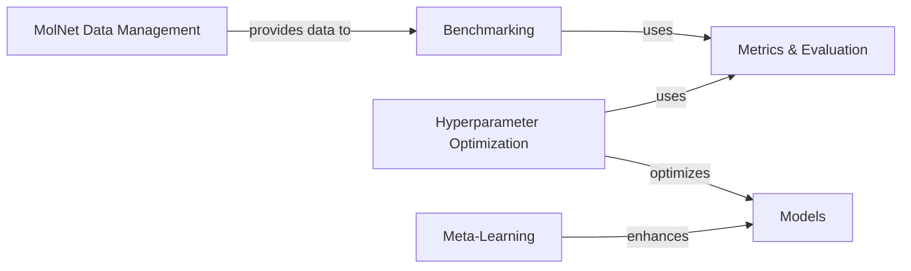

## Component Details

The Experimentation & Evaluation subsystem in DeepChem provides a comprehensive framework for conducting machine learning experiments, from data acquisition and preparation to model benchmarking, performance evaluation, and hyperparameter optimization. It integrates standardized datasets from MolNet, offers a variety of metrics for assessing model performance, and includes advanced techniques like meta-learning to enhance model adaptability. The core flow involves loading and featurizing data, training models, evaluating their performance using defined metrics, and iteratively optimizing hyperparameters or applying meta-learning strategies for improved results.

### MolNet Data Management

Facilitates access to standardized datasets from MolNet, providing functions to load and prepare diverse chemical and biological data for machine learning experiments.

**Related Classes/Methods**:

- `deepchem.molnet.load_function` (1:200)

- <a href="https://github.com/deepchem/deepchem/blob/master/deepchem/molnet/load_function/molnet_loader.py#L1-L200" target="_blank" rel="noopener noreferrer">`deepchem.molnet.load_function.molnet_loader` (1:200)</a>

- <a href="https://github.com/deepchem/deepchem/blob/master/deepchem/molnet/load_function/pdbbind_datasets.py#L116-L206" target="_blank" rel="noopener noreferrer">`deepchem.molnet.load_function.pdbbind_datasets.load_pdbbind` (116:206)</a>

- <a href="https://github.com/deepchem/deepchem/blob/master/datasets/construct_pdbbind_df.py#L1-L200" target="_blank" rel="noopener noreferrer">`deepchem.datasets.construct_pdbbind_df` (1:200)</a>

### Benchmarking

Enables the systematic evaluation and comparison of machine learning models across various datasets and tasks, providing a framework for performance assessment.

**Related Classes/Methods**:

- <a href="https://github.com/deepchem/deepchem/blob/master/deepchem/molnet/run_benchmark.py#L17-L237" target="_blank" rel="noopener noreferrer">`deepchem.molnet.run_benchmark` (17:237)</a>

- <a href="https://github.com/deepchem/deepchem/blob/master/deepchem/molnet/run_benchmark_models.py#L1-L200" target="_blank" rel="noopener noreferrer">`deepchem.molnet.run_benchmark_models` (1:200)</a>

- <a href="https://github.com/deepchem/deepchem/blob/master/deepchem/molnet/preset_hyper_parameters.py#L1-L200" target="_blank" rel="noopener noreferrer">`deepchem.molnet.preset_hyper_parameters` (1:200)</a>

### Metrics & Evaluation

Offers a comprehensive suite of quantitative metrics and utility functions to assess the performance and quality of machine learning models.

**Related Classes/Methods**:

- <a href="https://github.com/deepchem/deepchem/blob/master/deepchem/metrics/metric.py#L421-L726" target="_blank" rel="noopener noreferrer">`deepchem.metrics.Metric` (421:726)</a>

- <a href="https://github.com/deepchem/deepchem/blob/master/deepchem/metrics/genomic_metrics.py#L1-L200" target="_blank" rel="noopener noreferrer">`deepchem.metrics.genomic_metrics` (1:200)</a>

- <a href="https://github.com/deepchem/deepchem/blob/master/deepchem/metrics/score_function.py#L1-L200" target="_blank" rel="noopener noreferrer">`deepchem.metrics.score_function` (1:200)</a>

- <a href="https://github.com/deepchem/deepchem/blob/master/deepchem/utils/evaluate.py#L1-L200" target="_blank" rel="noopener noreferrer">`deepchem.utils.evaluate` (1:200)</a>

### Hyperparameter Optimization

Provides algorithms and strategies for automatically tuning the hyperparameters of machine learning models to achieve optimal performance.

**Related Classes/Methods**:

- <a href="https://github.com/deepchem/deepchem/blob/master/deepchem/hyper/base_classes.py#L1-L200" target="_blank" rel="noopener noreferrer">`deepchem.hyper.base_classes` (1:200)</a>

- <a href="https://github.com/deepchem/deepchem/blob/master/deepchem/hyper/gaussian_process.py#L1-L200" target="_blank" rel="noopener noreferrer">`deepchem.hyper.gaussian_process` (1:200)</a>

- <a href="https://github.com/deepchem/deepchem/blob/master/deepchem/hyper/grid_search.py#L1-L200" target="_blank" rel="noopener noreferrer">`deepchem.hyper.grid_search` (1:200)</a>

- <a href="https://github.com/deepchem/deepchem/blob/master/deepchem/hyper/random_search.py#L1-L200" target="_blank" rel="noopener noreferrer">`deepchem.hyper.random_search` (1:200)</a>

### Meta-Learning

Implements advanced learning paradigms that enable models to learn how to learn, improving their adaptability and efficiency on new, unseen tasks with limited data.

**Related Classes/Methods**:

- <a href="https://github.com/deepchem/deepchem/blob/master/deepchem/metalearning/maml.py#L1-L200" target="_blank" rel="noopener noreferrer">`deepchem.metalearning.maml` (1:200)</a>

- <a href="https://github.com/deepchem/deepchem/blob/master/deepchem/metalearning/torch_maml.py#L1-L200" target="_blank" rel="noopener noreferrer">`deepchem.metalearning.torch_maml` (1:200)</a>

### [FAQ](https://github.com/CodeBoarding/GeneratedOnBoardings/tree/main?tab=readme-ov-file#faq)