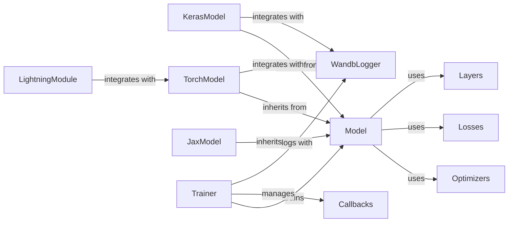

## Component Details

The Model Core & Training Frameworks subsystem provides the foundational infrastructure for building, training, and managing machine learning models within DeepChem. It encompasses abstract base classes for models, concrete implementations for various deep learning frameworks (Keras/TensorFlow, PyTorch, JAX), and essential components like optimizers, loss functions, and neural network layers. The system facilitates flexible model development, training management through a dedicated Trainer, and integration with experiment tracking tools like Weights & Biases, enabling comprehensive machine learning workflows.

### Model

The abstract base class for all machine learning models in DeepChem, providing a common interface for model definition, training, evaluation, and prediction.

**Related Classes/Methods**:

- `deepchem.models.Model` (36:1278)

### KerasModel

A concrete implementation of the Model class that integrates with the Keras/TensorFlow deep learning framework, allowing for the construction and training of models using Keras APIs.

**Related Classes/Methods**:

- <a href="https://github.com/deepchem/deepchem/blob/master/deepchem/models/keras_model.py#L36-L1278" target="_blank" rel="noopener noreferrer">`deepchem.models.keras_model.KerasModel` (36:1278)</a>

### TorchModel

A concrete implementation of the Model class that integrates with the PyTorch deep learning framework, enabling the development and training of models using PyTorch functionalities.

**Related Classes/Methods**:

- <a href="https://github.com/deepchem/deepchem/blob/master/deepchem/models/torch_models/torch_model.py#L41-L1263" target="_blank" rel="noopener noreferrer">`deepchem.models.torch_models.torch_model.TorchModel` (41:1263)</a>

### JaxModel

A concrete implementation of the Model class that integrates with the JAX deep learning framework, providing capabilities for building and training models with JAX's high-performance numerical computation.

**Related Classes/Methods**:

- <a href="https://github.com/deepchem/deepchem/blob/master/deepchem/models/jax_models/jax_model.py#L73-L698" target="_blank" rel="noopener noreferrer">`deepchem.models.jax_models.jax_model.JaxModel` (73:698)</a>

### Optimizers

A collection of optimization algorithms used to update model weights during the training process, supporting various deep learning frameworks.

**Related Classes/Methods**:

- `deepchem.models.optimizers` (full file reference)

### Losses

A module containing various loss functions used to quantify the difference between predicted and actual values, guiding the model's learning process.

**Related Classes/Methods**:

- `deepchem.models.losses` (full file reference)

### Layers

Provides a set of generic neural network layers that can be used across different model architectures and deep learning frameworks.

**Related Classes/Methods**:

- `deepchem.models.layers` (full file reference)

### Trainer

Manages the overall training process for models, including iterating over epochs, handling batches, and applying optimization steps.

**Related Classes/Methods**:

- `deepchem.models.trainer` (full file reference)

### Callbacks

Provides a mechanism to execute custom actions at various stages of the training process, such as logging, early stopping, or model checkpointing.

**Related Classes/Methods**:

- `deepchem.models.callbacks` (full file reference)

### WandbLogger

Integrates with Weights & Biases for experiment tracking, visualization, and management of machine learning training runs.

**Related Classes/Methods**:

- `deepchem.models.wandblogger` (full file reference)

### LightningModule

Provides an interface for integrating DeepChem models with PyTorch Lightning, simplifying the training and deployment of PyTorch-based models.

**Related Classes/Methods**:

- `deepchem.models.lightning.dc_lightning_module` (full file reference)

### [FAQ](https://github.com/CodeBoarding/GeneratedOnBoardings/tree/main?tab=readme-ov-file#faq)