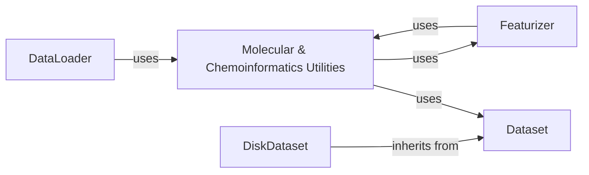

## Component Details

The `Molecular & Chemoinformatics Utilities` component in DeepChem serves as a foundational library providing a wide array of helper functions and tools for handling molecular structures, chemical properties, and geometric computations. It encompasses functionalities ranging from RDKit operations for molecular manipulation and property calculation, to utilities for managing molecular coordinates, analyzing non-covalent interactions, and generating conformers. This component also includes specialized tools for processing PDBQT files, handling polymer and genomic data, performing Density Functional Theory (DFT) calculations, and facilitating molecular docking simulations. These utilities are crucial for preparing and transforming chemical and biological data into formats suitable for machine learning models, supporting various featurization, modeling, and analysis workflows across the DeepChem ecosystem. It interacts closely with `Featurizer` components to enable the conversion of raw data into numerical features, and its outputs can be consumed by `Dataset` objects for further processing and model training.

### Molecular & Chemoinformatics Utilities

Provides a comprehensive set of fundamental helper functions and tools for handling molecular structures, chemical properties, geometric computations, and general scientific data manipulation. This includes RDKit operations, coordinate manipulation, non-covalent interaction analysis, conformer generation, PDBQT handling, and specialized utilities for polymers, genomics, DFT, and molecular docking.

**Related Classes/Methods**:

- <a href="https://github.com/deepchem/deepchem/blob/master/deepchem/utils/rdkit_utils.py#L1-L1396" target="_blank" rel="noopener noreferrer">`deepchem.utils.rdkit_utils` (1:1396)</a>

- <a href="https://github.com/deepchem/deepchem/blob/master/deepchem/utils/geometry_utils.py#L1-L200" target="_blank" rel="noopener noreferrer">`deepchem.utils.geometry_utils` (1:200)</a>

- <a href="https://github.com/deepchem/deepchem/blob/master/deepchem/utils/coordinate_box_utils.py#L1-L100" target="_blank" rel="noopener noreferrer">`deepchem.utils.coordinate_box_utils` (1:100)</a>

- <a href="https://github.com/deepchem/deepchem/blob/master/deepchem/utils/fragment_utils.py#L1-L200" target="_blank" rel="noopener noreferrer">`deepchem.utils.fragment_utils` (1:200)</a>

- <a href="https://github.com/deepchem/deepchem/blob/master/deepchem/utils/noncovalent_utils.py#L1-L100" target="_blank" rel="noopener noreferrer">`deepchem.utils.noncovalent_utils` (1:100)</a>

- <a href="https://github.com/deepchem/deepchem/blob/master/deepchem/utils/conformers.py#L1-L100" target="_blank" rel="noopener noreferrer">`deepchem.utils.conformers` (1:100)</a>

- <a href="https://github.com/deepchem/deepchem/blob/master/deepchem/utils/pdbqt_utils.py#L1-L200" target="_blank" rel="noopener noreferrer">`deepchem.utils.pdbqt_utils` (1:200)</a>

- <a href="https://github.com/deepchem/deepchem/blob/master/deepchem/utils/molecule_feature_utils.py#L1-L100" target="_blank" rel="noopener noreferrer">`deepchem.utils.molecule_feature_utils` (1:100)</a>

- <a href="https://github.com/deepchem/deepchem/blob/master/deepchem/utils/poly_wd_graph_utils.py#L1-L100" target="_blank" rel="noopener noreferrer">`deepchem.utils.poly_wd_graph_utils` (1:100)</a>

- <a href="https://github.com/deepchem/deepchem/blob/master/deepchem/utils/poly_converters.py#L1-L100" target="_blank" rel="noopener noreferrer">`deepchem.utils.poly_converters` (1:100)</a>

- <a href="https://github.com/deepchem/deepchem/blob/master/deepchem/utils/grover.py#L1-L100" target="_blank" rel="noopener noreferrer">`deepchem.utils.grover` (1:100)</a>

- <a href="https://github.com/deepchem/deepchem/blob/master/deepchem/utils/electron_sampler.py#L1-L100" target="_blank" rel="noopener noreferrer">`deepchem.utils.electron_sampler` (1:100)</a>

- <a href="https://github.com/deepchem/deepchem/blob/master/deepchem/utils/sequence_utils.py#L1-L100" target="_blank" rel="noopener noreferrer">`deepchem.utils.sequence_utils` (1:100)</a>

- <a href="https://github.com/deepchem/deepchem/blob/master/deepchem/utils/voxel_utils.py#L1-L100" target="_blank" rel="noopener noreferrer">`deepchem.utils.voxel_utils` (1:100)</a>

- <a href="https://github.com/deepchem/deepchem/blob/master/deepchem/utils/genomics_utils.py#L1-L100" target="_blank" rel="noopener noreferrer">`deepchem.utils.genomics_utils` (1:100)</a>

- `deepchem.utils.dft_utils` (1:100)

- <a href="https://github.com/deepchem/deepchem/blob/master/deepchem/utils/dftutils.py#L1-L100" target="_blank" rel="noopener noreferrer">`deepchem.utils.dftutils` (1:100)</a>

- <a href="https://github.com/deepchem/deepchem/blob/master/deepchem/utils/docking_utils.py#L1-L100" target="_blank" rel="noopener noreferrer">`deepchem.utils.docking_utils` (1:100)</a>

- <a href="https://github.com/deepchem/deepchem/blob/master/deepchem/utils/vina_utils.py#L1-L100" target="_blank" rel="noopener noreferrer">`deepchem.utils.vina_utils` (1:100)</a>

- `deepchem.dock` (1:100)

- `deepchem.feat.complex_featurizers` (1:100)

- <a href="https://github.com/deepchem/deepchem/blob/master/deepchem/feat/dft_data.py#L1-L100" target="_blank" rel="noopener noreferrer">`deepchem.feat.dft_data` (1:100)</a>

### DataLoader

The DataLoader component is an abstract superclass responsible for loading and featurizing raw data into a structured Dataset object. It provides a general framework for processing various input data types, delegating specific data handling and featurization logic to its subclasses and an associated Featurizer.

**Related Classes/Methods**:

- <a href="https://github.com/deepchem/deepchem/blob/master/deepchem/data/data_loader.py#L1-L200" target="_blank" rel="noopener noreferrer">`deepchem.data.data_loader.DataLoader` (1:200)</a>

### Featurizer

The Featurizer component is an abstract base class for all featurizers in DeepChem. Its primary purpose is to transform raw chemical or biological data into numerical feature vectors that can be used as input for machine learning models. Subclasses implement specific featurization logic for different data types.

**Related Classes/Methods**:

- <a href="https://github.com/deepchem/deepchem/blob/master/deepchem/feat/base_classes.py#L1-L200" target="_blank" rel="noopener noreferrer">`deepchem.feat.base_classes.Featurizer` (1:200)</a>

### Dataset

The Dataset component represents a collection of featurized data, including input features (X), labels (y), weights (w), and identifiers (ids). It provides methods for data manipulation, such as sharding, transforming, and iterating over data, and serves as the primary data structure for training and evaluating models in DeepChem.

**Related Classes/Methods**:

- <a href="https://github.com/deepchem/deepchem/blob/master/deepchem/data/datasets.py#L1-L200" target="_blank" rel="noopener noreferrer">`deepchem.data.datasets.Dataset` (1:200)</a>

### DiskDataset

The DiskDataset component is a concrete implementation of the Dataset class that stores featurized data on disk. It is designed to handle large datasets efficiently by sharding the data into smaller files, allowing for out-of-memory processing and reducing memory footprint during training and evaluation.

**Related Classes/Methods**:

- <a href="https://github.com/deepchem/deepchem/blob/master/deepchem/data/datasets.py#L1-L200" target="_blank" rel="noopener noreferrer">`deepchem.data.datasets.DiskDataset` (1:200)</a>

### [FAQ](https://github.com/CodeBoarding/GeneratedOnBoardings/tree/main?tab=readme-ov-file#faq)