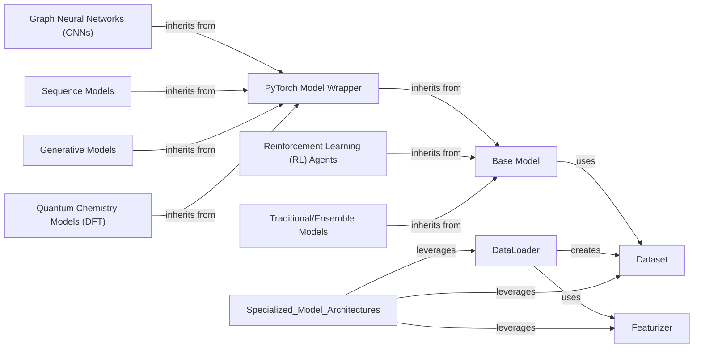

## Component Details

The Specialized Model Architectures component in DeepChem provides a comprehensive suite of pre-built machine learning models, meticulously designed for diverse scientific applications, particularly in chemistry and biology. This component encompasses a wide array of model types, including Graph Neural Networks (GNNs) for molecular structures, sequence models for biological sequences and text, image models for analyzing scientific images, generative models for de novo molecular design, reinforcement learning agents for optimizing chemical processes, quantum chemistry models (DFT) for high-fidelity simulations, and traditional/ensemble methods for baseline and robust predictions. These specialized models are built upon a flexible and extensible base model infrastructure, allowing them to seamlessly integrate with DeepChem's core training and data handling utilities. Their primary purpose is to enable researchers and developers to quickly apply state-of-the-art machine learning techniques to complex scientific problems, leveraging optimized architectures for specific data modalities and computational challenges.

### Base Model

The foundational abstract class for all models in DeepChem, providing a common interface and core functionalities for training, evaluation, and prediction. It handles general model management, checkpointing, and integration with data pipelines.

**Related Classes/Methods**:

- `deepchem.models.Model` (28:1000)

### PyTorch Model Wrapper

A specialized wrapper for PyTorch models, extending the Base Model to integrate PyTorch's neural network capabilities within the DeepChem framework. It manages PyTorch-specific training loops, device placement, and optimization.

**Related Classes/Methods**:

- <a href="https://github.com/deepchem/deepchem/blob/master/deepchem/models/torch_models/torch_model.py#L41-L1263" target="_blank" rel="noopener noreferrer">`deepchem.models.torch_models.torch_model.TorchModel` (41:1263)</a>

### Graph Neural Networks (GNNs)

A collection of models specifically designed to process graph-structured data, such as molecular graphs. These models learn representations by aggregating information from neighboring nodes and edges, enabling predictions on molecular properties, interactions, and more.

**Related Classes/Methods**:

- <a href="https://github.com/deepchem/deepchem/blob/master/deepchem/models/torch_models/graphconvmodel.py#L251-L421" target="_blank" rel="noopener noreferrer">`deepchem.models.torch_models.graphconvmodel.GraphConvModel` (251:421)</a>

- <a href="https://github.com/deepchem/deepchem/blob/master/deepchem/models/torch_models/mpnn.py#L28-L1000" target="_blank" rel="noopener noreferrer">`deepchem.models.torch_models.mpnn.MPNNModel` (28:1000)</a>

- <a href="https://github.com/deepchem/deepchem/blob/master/deepchem/models/torch_models/gat.py#L28-L1000" target="_blank" rel="noopener noreferrer">`deepchem.models.torch_models.gat.GATModel` (28:1000)</a>

- <a href="https://github.com/deepchem/deepchem/blob/master/deepchem/models/torch_models/gcn.py#L28-L1000" target="_blank" rel="noopener noreferrer">`deepchem.models.torch_models.gcn.GCNModel` (28:1000)</a>

### Sequence Models

Models tailored for processing sequential data, including chemical sequences (SMILES), biological sequences (proteins, DNA), and general text. This category includes various architectures like recurrent neural networks and transformer-based models.

**Related Classes/Methods**:

- <a href="https://github.com/deepchem/deepchem/blob/master/deepchem/models/seqtoseq.py#L43-L416" target="_blank" rel="noopener noreferrer">`deepchem.models.seqtoseq.SeqToSeq` (43:416)</a>

- <a href="https://github.com/deepchem/deepchem/blob/master/deepchem/models/text_cnn.py#L28-L1000" target="_blank" rel="noopener noreferrer">`deepchem.models.text_cnn.TextCNNModel` (28:1000)</a>

- <a href="https://github.com/deepchem/deepchem/blob/master/deepchem/models/torch_models/smiles2vec.py#L28-L1000" target="_blank" rel="noopener noreferrer">`deepchem.models.torch_models.smiles2vec.SMILES2Vec` (28:1000)</a>

- <a href="https://github.com/deepchem/deepchem/blob/master/deepchem/models/torch_models/hf_models.py#L22-L632" target="_blank" rel="noopener noreferrer">`deepchem.models.torch_models.hf_models.HuggingFaceModel` (22:632)</a>

### Generative Models

Architectures designed for generating new data instances, such as novel molecules. This includes Generative Adversarial Networks (GANs) and Normalizing Flows, which learn the underlying data distribution to synthesize new samples.

**Related Classes/Methods**:

- <a href="https://github.com/deepchem/deepchem/blob/master/deepchem/models/molgan.py#L28-L1000" target="_blank" rel="noopener noreferrer">`deepchem.models.molgan.MolGAN` (28:1000)</a>

- <a href="https://github.com/deepchem/deepchem/blob/master/deepchem/models/normalizing_flows.py#L28-L1000" target="_blank" rel="noopener noreferrer">`deepchem.models.normalizing_flows.NormalizingFlow` (28:1000)</a>

- <a href="https://github.com/deepchem/deepchem/blob/master/deepchem/models/torch_models/gan.py#L12-L496" target="_blank" rel="noopener noreferrer">`deepchem.models.torch_models.gan.GAN` (12:496)</a>

### Reinforcement Learning (RL) Agents

Models and frameworks for developing agents that learn to make decisions by interacting with an environment, often used for optimizing chemical synthesis pathways or drug discovery processes.

**Related Classes/Methods**:

- `deepchem.rl.rl_model.RLModel` (28:1000)

### Quantum Chemistry Models (DFT)

Specialized models for quantum chemistry calculations, particularly Density Functional Theory (DFT), enabling high-accuracy predictions of electronic structure and molecular properties.

**Related Classes/Methods**:

- `deepchem.models.dft.dft_model.DFTModel` (28:1000)

- <a href="https://github.com/deepchem/deepchem/blob/master/deepchem/models/torch_models/ferminet.py#L28-L1000" target="_blank" rel="noopener noreferrer">`deepchem.models.torch_models.ferminet.FerminetModel` (28:1000)</a>

### Traditional/Ensemble Models

Includes implementations of classical machine learning algorithms and ensemble methods, providing robust baselines and alternative approaches for various cheminformatics and bioinformatics tasks.

**Related Classes/Methods**:

- <a href="https://github.com/deepchem/deepchem/blob/master/deepchem/models/sklearn_models/sklearn_model.py#L28-L1000" target="_blank" rel="noopener noreferrer">`deepchem.models.sklearn_models.sklearn_model.SklearnModel` (28:1000)</a>

- <a href="https://github.com/deepchem/deepchem/blob/master/deepchem/models/gbdt_models/gbdt_model.py#L28-L1000" target="_blank" rel="noopener noreferrer">`deepchem.models.gbdt_models.gbdt_model.GBDTModel` (28:1000)</a>

### DataLoader

An abstract superclass responsible for loading and featurizing raw data into a structured Dataset object. It provides a general framework for processing various input data types, delegating specific data handling and featurization logic to its subclasses and an associated Featurizer.

**Related Classes/Methods**:

- <a href="https://github.com/deepchem/deepchem/blob/master/deepchem/data/data_loader.py#L28-L1000" target="_blank" rel="noopener noreferrer">`deepchem.data.data_loader.DataLoader` (28:1000)</a>

### Featurizer

An abstract base class for all featurizers in DeepChem. Its primary purpose is to transform raw chemical or biological data into numerical feature vectors that can be used as input for machine learning models.

**Related Classes/Methods**:

- <a href="https://github.com/deepchem/deepchem/blob/master/deepchem/feat/base_classes.py#L28-L1000" target="_blank" rel="noopener noreferrer">`deepchem.feat.base_classes.Featurizer` (28:1000)</a>

### Dataset

Represents a collection of featurized data, including input features (X), labels (y), weights (w), and identifiers (ids). It provides methods for data manipulation, such as sharding, transforming, and iterating over data, and serves as the primary data structure for training and evaluating models in DeepChem.

**Related Classes/Methods**:

- <a href="https://github.com/deepchem/deepchem/blob/master/deepchem/data/datasets.py#L28-L1000" target="_blank" rel="noopener noreferrer">`deepchem.data.datasets.Dataset` (28:1000)</a>

### [FAQ](https://github.com/CodeBoarding/GeneratedOnBoardings/tree/main?tab=readme-ov-file#faq)