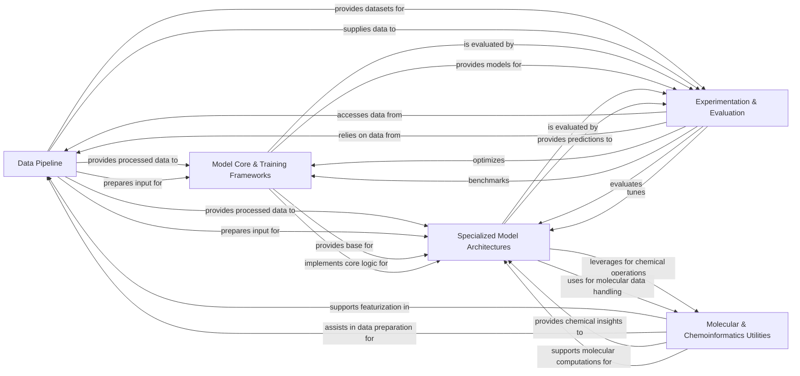

## Component Details

The DeepChem library provides a comprehensive platform for cheminformatics and machine learning in drug discovery, materials science, and quantum chemistry. Its core functionality revolves around a robust data pipeline that handles data loading, featurization, and preprocessing. This prepared data then feeds into a flexible model core that supports various deep learning frameworks and a wide array of specialized model architectures, including graph neural networks, generative models, and quantum chemistry models. Complementing these are extensive molecular and chemoinformatics utilities for detailed chemical manipulations and interactions, and a dedicated experimentation and evaluation component that facilitates benchmarking, hyperparameter tuning, and meta-learning to optimize model performance and accelerate scientific discovery.

### Data Pipeline

Manages the entire data lifecycle, from loading raw data and converting it into numerical features (featurization) to applying various transformations (preprocessing) and splitting datasets for training and evaluation. It handles diverse data formats and ensures data readiness for machine learning models.

**Related Classes/Methods**:

- <a href="https://github.com/deepchem/deepchem/blob/master/deepchem/data/datasets.py#L221-L743" target="_blank" rel="noopener noreferrer">`deepchem.data.datasets.Dataset` (221:743)</a>

- <a href="https://github.com/deepchem/deepchem/blob/master/deepchem/data/data_loader.py#L72-L278" target="_blank" rel="noopener noreferrer">`deepchem.data.data_loader.DataLoader` (72:278)</a>

- `deepchem.utils.data_utils` (full file reference)

- `deepchem.utils.cache_utils` (full file reference)

- `deepchem.feat.base_classes` (full file reference)

- `deepchem.feat.deepvariant_featurizer` (full file reference)

- `deepchem.feat.graph_data` (full file reference)

- `deepchem.feat.reaction_featurizer` (full file reference)

- `deepchem.feat.binding_pocket_features` (full file reference)

- `deepchem.feat.dft_data` (full file reference)

- `deepchem.feat.mol_graphs` (full file reference)

- `deepchem.feat.roberta_tokenizer` (full file reference)

- `deepchem.feat.atomic_conformation` (full file reference)

- `deepchem.feat.smiles_tokenizer` (full file reference)

- `deepchem.feat.graph_features` (full file reference)

- `deepchem.feat.deepvariant_pileup_featurizer` (full file reference)

- `deepchem.feat.sequence_featurizers` (full file reference)

- `deepchem.feat.molecule_featurizers` (full file reference)

- `deepchem.feat.material_featurizers` (full file reference)

- `deepchem.feat.complex_featurizers` (full file reference)

- `deepchem.feat.vocabulary_builders` (full file reference)

- <a href="https://github.com/deepchem/deepchem/blob/master/deepchem/trans/transformers.py#L56-L238" target="_blank" rel="noopener noreferrer">`deepchem.trans.transformers.Transformer` (56:238)</a>

- `deepchem.trans.duplicate` (full file reference)

- <a href="https://github.com/deepchem/deepchem/blob/master/deepchem/splits/splitters.py#L31-L325" target="_blank" rel="noopener noreferrer">`deepchem.splits.splitters.Splitter` (31:325)</a>

- `deepchem.splits.task_splitter` (full file reference)

- `deepchem.data.supports` (full file reference)

- `deepchem.contrib.atomicconv.splits` (full file reference)

### Model Core & Training Frameworks

Provides the foundational infrastructure for building, training, and managing machine learning models. This includes base model classes, optimizers, loss functions, and integrations with deep learning frameworks like Keras/TensorFlow, PyTorch, and JAX, enabling flexible model development and deployment.

**Related Classes/Methods**:

- `deepchem.models.models` (full file reference)

- <a href="https://github.com/deepchem/deepchem/blob/master/deepchem/models/keras_model.py#L36-L1278" target="_blank" rel="noopener noreferrer">`deepchem.models.keras_model.KerasModel` (36:1278)</a>

- <a href="https://github.com/deepchem/deepchem/blob/master/deepchem/models/torch_models/torch_model.py#L41-L1263" target="_blank" rel="noopener noreferrer">`deepchem.models.torch_models.torch_model.TorchModel` (41:1263)</a>

- <a href="https://github.com/deepchem/deepchem/blob/master/deepchem/models/jax_models/jax_model.py#L73-L698" target="_blank" rel="noopener noreferrer">`deepchem.models.jax_models.jax_model.JaxModel` (73:698)</a>

- `deepchem.models.optimizers` (full file reference)

- `deepchem.models.losses` (full file reference)

- `deepchem.models.wandblogger` (full file reference)

- `deepchem.models.lightning` (full file reference)

- `deepchem.models.layers` (full file reference)

- `deepchem.models.chemnet_layers` (full file reference)

- `deepchem.models.torch_models.layers` (full file reference)

- `deepchem.models.torch_models.readout` (full file reference)

- `deepchem.models.torch_models.grover_layers` (full file reference)

- `deepchem.models.torch_models.pna_gnn` (full file reference)

- `deepchem.models.torch_models.attention` (full file reference)

### Specialized Model Architectures

Houses a diverse collection of pre-built machine learning models tailored for specific scientific domains and data types, including Graph Neural Networks (GNNs), sequence models, image models, generative models, reinforcement learning agents, quantum chemistry models (DFT), and traditional/ensemble methods. These models leverage the core training infrastructure to solve complex problems in chemistry and biology.

**Related Classes/Methods**:

- `deepchem.models.graph_models` (full file reference)

- `deepchem.models.torch_models.graphconvmodel` (full file reference)

- `deepchem.models.torch_models.mpnn` (full file reference)

- `deepchem.models.torch_models.gat` (full file reference)

- `deepchem.models.torch_models.gcn` (full file reference)

- `deepchem.models.torch_models.attentivefp` (full file reference)

- `deepchem.models.torch_models.pagtn` (full file reference)

- `deepchem.models.torch_models.infograph` (full file reference)

- `deepchem.models.torch_models.megnet` (full file reference)

- `deepchem.models.torch_models.cgcnn` (full file reference)

- `deepchem.models.torch_models.lcnn` (full file reference)

- `deepchem.models.torch_models.gnn3d` (full file reference)

- `deepchem.models.torch_models.mxmnet` (full file reference)

- `deepchem.models.torch_models.dmpnn` (full file reference)

- `deepchem.models.torch_models.acnn` (full file reference)

- `deepchem.models.torch_models.grover` (full file reference)

- `deepchem.models.chemnet_models` (full file reference)

- `deepchem.models.seqtoseq` (full file reference)

- `deepchem.models.text_cnn` (full file reference)

- `deepchem.models.torch_models.smiles2vec` (full file reference)

- `deepchem.models.torch_models.text_cnn` (full file reference)

- `deepchem.models.torch_models.hf_models` (full file reference)

- `deepchem.models.torch_models.antibody_modeling` (full file reference)

- `deepchem.models.torch_models.chemberta` (full file reference)

- `deepchem.models.torch_models.molformer` (full file reference)

- `deepchem.models.torch_models.oneformer` (full file reference)

- `deepchem.models.torch_models.inceptionv3` (full file reference)

- `deepchem.models.torch_models.mobilenetv2` (full file reference)

- `deepchem.models.torch_models.unet` (full file reference)

- `deepchem.models.torch_models.cnn` (full file reference)

- `deepchem.models.molgan` (full file reference)

- `deepchem.models.normalizing_flows` (full file reference)

- `deepchem.models.torch_models.flows` (full file reference)

- `deepchem.models.torch_models.gan` (full file reference)

- `deepchem.models.torch_models.molgan` (full file reference)

- `deepchem.models.torch_models.lstm_generator_models` (full file reference)

- `deepchem.rl` (full file reference)

- `deepchem.contrib.rl` (full file reference)

- `deepchem.models.dft` (full file reference)

- `deepchem.models.torch_models.ferminet` (full file reference)

- `deepchem.models.sklearn_models` (full file reference)

- `deepchem.models.gbdt_models` (full file reference)

- `deepchem.models.fcnet` (full file reference)

- `deepchem.models.robust_multitask` (full file reference)

- `deepchem.models.scscore` (full file reference)

- `deepchem.models.IRV` (full file reference)

- `deepchem.contrib.autoencoder_models` (full file reference)

- `deepchem.contrib.dragonn` (full file reference)

- `deepchem.contrib.DeepMHC` (full file reference)

- `deepchem.contrib.laplacian` (full file reference)

- `deepchem.contrib.DiabeticRetinopathy` (full file reference)

- `deepchem.contrib.vina_model` (full file reference)

- `deepchem.contrib.atomicconv.models` (full file reference)

- `deepchem.contrib.hagcn` (full file reference)

- `deepchem.contrib.one_shot_models` (full file reference)

- `deepchem.contrib.mpnn` (full file reference)

### Molecular & Chemoinformatics Utilities

Provides a comprehensive set of fundamental helper functions and tools for handling molecular structures, chemical properties, geometric computations, and general scientific data manipulation. This includes RDKit operations, coordinate manipulation, non-covalent interaction analysis, conformer generation, PDBQT handling, and specialized utilities for polymers, genomics, DFT, and molecular docking.

**Related Classes/Methods**:

- `deepchem.utils.rdkit_utils` (full file reference)

- `deepchem.utils.geometry_utils` (full file reference)

- `deepchem.utils.coordinate_box_utils` (full file reference)

- `deepchem.utils.fragment_utils` (full file reference)

- `deepchem.utils.noncovalent_utils` (full file reference)

- `deepchem.utils.conformers` (full file reference)

- `deepchem.utils.pdbqt_utils` (full file reference)

- `deepchem.utils.molecule_feature_utils` (full file reference)

- `deepchem.utils.poly_wd_graph_utils` (full file reference)

- `deepchem.utils.poly_converters` (full file reference)

- `deepchem.utils.grover` (full file reference)

- `deepchem.utils.electron_sampler` (full file reference)

- `deepchem.utils.sequence_utils` (full file reference)

- `deepchem.utils.voxel_utils` (full file reference)

- `deepchem.utils.genomics_utils` (full file reference)

- `deepchem.utils.dft_utils` (full file reference)

- `deepchem.utils.docking_utils` (full file reference)

- `deepchem.dock` (full file reference)

- `deepchem.feat.complex_featurizers` (full file reference)

### Experimentation & Evaluation

Facilitates the entire experimental workflow, from accessing standardized datasets (MolNet) and benchmarking models to evaluating performance using various metrics and optimizing model hyperparameters. It also includes advanced learning techniques like meta-learning to enhance model adaptability and efficiency.

**Related Classes/Methods**:

- `deepchem.molnet` (full file reference)

- `deepchem.datasets.construct_pdbbind_df` (full file reference)

- `deepchem.molnet.load_function` (full file reference)

- <a href="https://github.com/deepchem/deepchem/blob/master/deepchem/molnet/run_benchmark.py#L17-L237" target="_blank" rel="noopener noreferrer">`deepchem.molnet.run_benchmark` (17:237)</a>

- `deepchem.contrib.pubchem_dataset` (full file reference)

- <a href="https://github.com/deepchem/deepchem/blob/master/deepchem/metrics/metric.py#L421-L726" target="_blank" rel="noopener noreferrer">`deepchem.metrics.Metric` (421:726)</a>

- `deepchem.metrics.genomic_metrics` (full file reference)

- `deepchem.metrics.score_function` (full file reference)

- `deepchem.utils.evaluate` (full file reference)

- `deepchem.hyper` (full file reference)

- `deepchem.hyper.base_classes` (full file reference)

- `deepchem.hyper.gaussian_process` (full file reference)

- `deepchem.hyper.grid_search` (full file reference)

- `deepchem.hyper.random_search` (full file reference)

- `deepchem.metalearning` (full file reference)

- `deepchem.metalearning.maml` (full file reference)

- `deepchem.metalearning.torch_maml` (full file reference)

### [FAQ](https://github.com/CodeBoarding/GeneratedOnBoardings/tree/main?tab=readme-ov-file#faq)