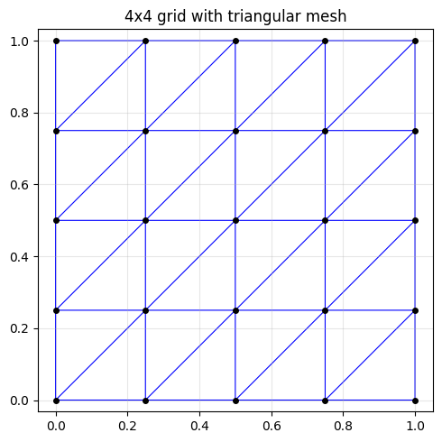
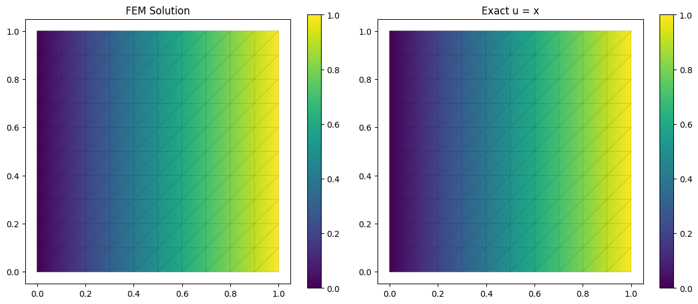
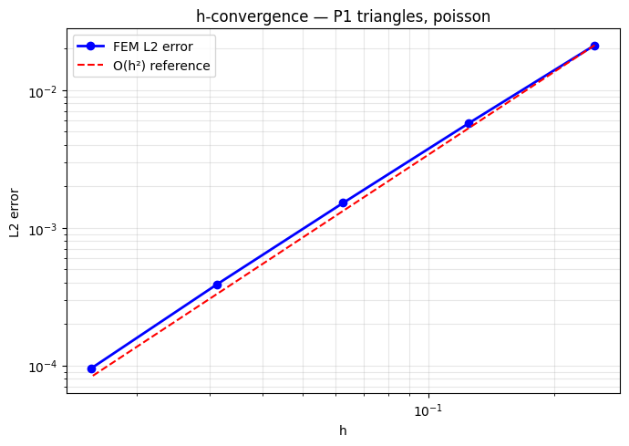

# 📐 Differentiable Finite Element Method in DeepChem

**GSoC Proposal — Differentiable FEM/FVM**

An end-to-end differentiable 2D FEM solver in PyTorch, integrated with DeepChem's `TorchModel` and `NumpyDataset` abstractions.

## Features

1. A reusable `FEMMesh` data structure with a structured mesh generator
2. A vectorised, GPU-friendly stiffness assembly (Poisson equation, P1 triangles)
3. A sparse-compatible penalty-method BC application that preserves autograd
4. A `DifferentiableFEMModel` that subclasses `dc.models.TorchModel`
5. Benchmarks against `scipy.sparse.linalg.spsolve` (accuracy + timing)
6. An h-convergence study confirming O(h²) for P1 elements

## Results

### Triangular Mesh (4×4 grid)

<p align="center">
  
</p>

### Forward Solve — Laplace Equation

FEM solution vs exact solution $u(x,y) = x$ on a 10×10 mesh:

<p align="center">
  
</p>

### h-Convergence Study

Confirms the expected O(h²) convergence rate for P1 triangular elements:

<p align="center">
  
</p>

## Installation

```bash
pip install -r requirements.txt
pip install -e .
```

## Project Structure

```
diffem/
├── diffem/                     # Core package
│   ├── __init__.py
│   ├── mesh.py                 # FEMMesh data structure + dataset helper
│   ├── mesh_generator.py       # Structured unit-square mesh generator
│   ├── reference_element.py    # P1 triangle shape functions & quadrature
│   ├── assembler.py            # Differentiable stiffness/load assembly
│   ├── solver.py               # Penalty-method BC solver
│   └── model.py                # DeepChem TorchModel integration
├── scripts/                    # Runnable demos & benchmarks
│   ├── forward_solve.py        # Laplace equation on 10×10 mesh
│   ├── benchmark_scipy.py      # PyTorch vs SciPy comparison
│   ├── convergence_study.py    # h-convergence (O(h²) verification)
│   ├── differentiability_tests.py  # Shape opt + finite-diff gradient check
│   └── demo_deepchem.py        # DeepChem integration demo
├── tests/
│   └── test_diffem.py          # Unit tests
├── requirements.txt
├── pyproject.toml
└── README.md
```

## Usage

### Quick forward solve

```python
from diffem import generate_unit_square_mesh, P1Triangle, DifferentiableAssembler, DifferentiableFEMSolver

mesh = generate_unit_square_mesh(10, 10)
ref = P1Triangle()
asm = DifferentiableAssembler(mesh, ref)
slv = DifferentiableFEMSolver(mesh, asm)

bc = {}
for n in mesh.boundary_nodes["left"]:   bc[n] = 0.0
for n in mesh.boundary_nodes["right"]:  bc[n] = 1.0

u = slv.solve(bc)
```

### DeepChem integration

```python
from diffem import generate_unit_square_mesh, P1Triangle, mesh_to_dataset, DifferentiableFEMModel

mesh = generate_unit_square_mesh(4, 4)
ref = P1Triangle()
bc = {}
for n in mesh.boundary_nodes["left"]:   bc[n] = 0.0
for n in mesh.boundary_nodes["right"]:  bc[n] = 1.0

ds = mesh_to_dataset(mesh)
model = DifferentiableFEMModel(mesh, ref, bc, learning_rate=0.01, batch_size=mesh.n_nodes)
u_pred = model.predict(ds)
```

### Running scripts

```bash
python scripts/forward_solve.py
python scripts/benchmark_scipy.py
python scripts/convergence_study.py
python scripts/differentiability_tests.py
python scripts/demo_deepchem.py
```

### Running tests

```bash
python -m pytest tests/
# or simply:
python tests/test_diffem.py
```

## Planned Extensions (GSoC Timeline)

- **Inverse problem:** Material identification
- **Sparse solve:** Custom `torch.autograd.Function` wrapping CHOLMOD/LU to eliminate dense bottleneck
- **Higher-order elements:** P2 triangles, bilinear quads
- **3D support:** Tetrahedral elements with same vectorised pattern
- **Additional PDEs:** Linear elasticity, advection-diffusion, time-dependent problems
- **FVM branch:** Cell-centred finite volume for conservation laws
- **Mesh I/O:** Gmsh `.msh` reader, VTK export for ParaView
